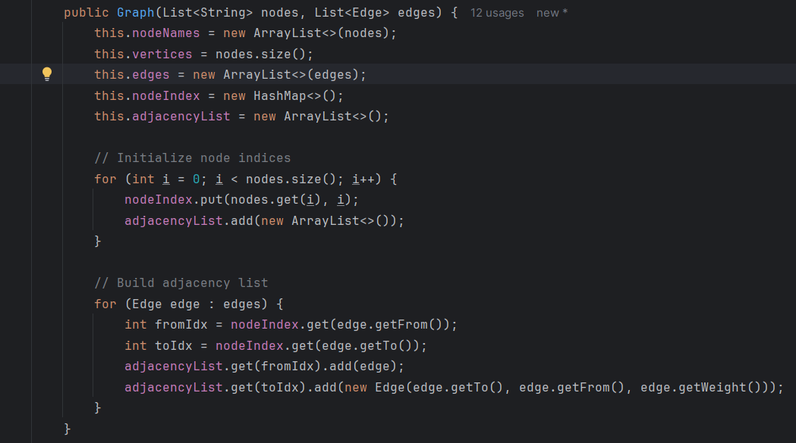
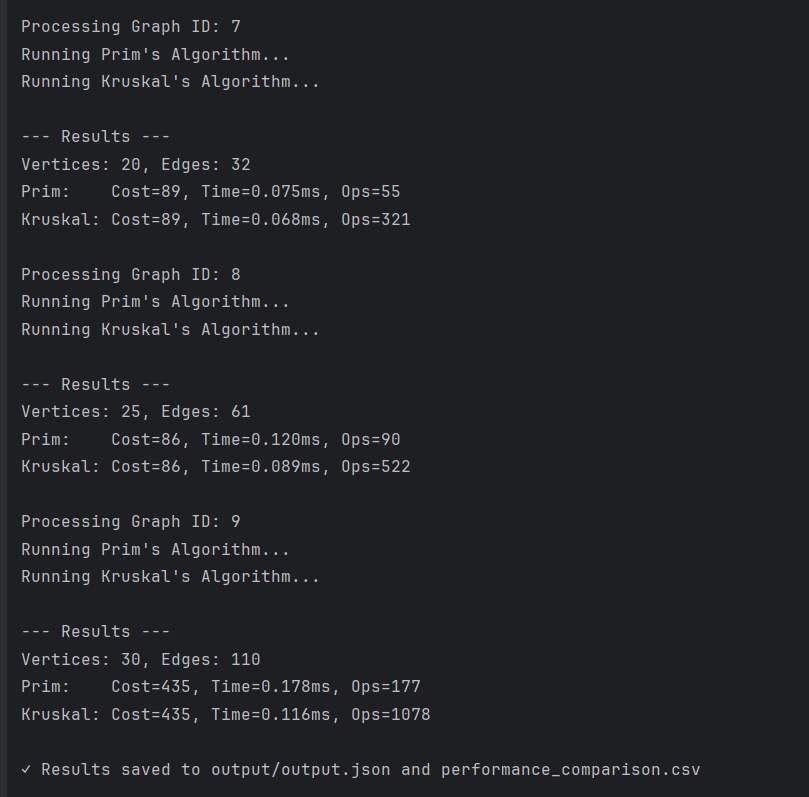
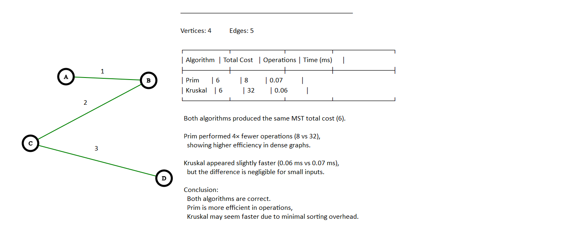
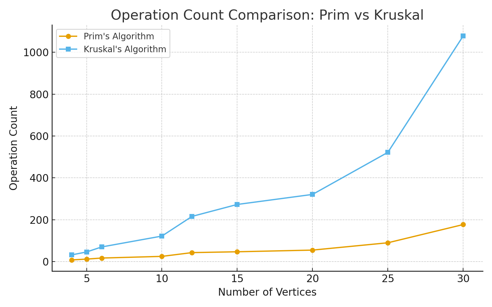
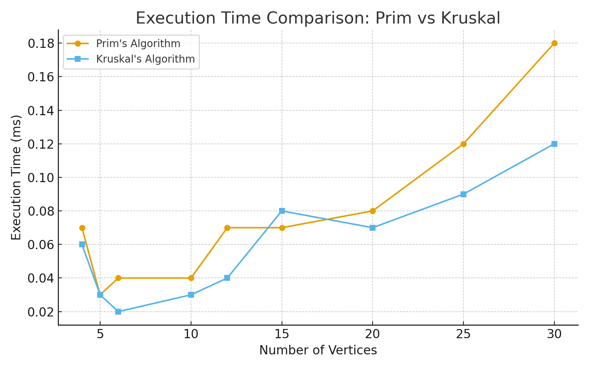

# Assignment 3: Optimization of a City Transportation Network (Minimum Spanning Tree)

## Student: Dosmagambetov Rakhat,   Group: SE-2434

###  Objective
The goal of this project is to optimize a city’s transportation network using **Prim’s** and **Kruskal’s** algorithms to determine the **Minimum Spanning Tree (MST)** — the minimum-cost set of roads connecting all districts.  
Both algorithms were implemented, tested, and compared in terms of **execution time**, **operation count**, and **efficiency**.

---

### Algorithms Implemented
- **Prim’s Algorithm**
    - Builds the MST incrementally, always adding the minimum edge that connects the tree to a new vertex.
- **Kruskal’s Algorithm**
    - Sorts all edges by weight and adds them to the MST if they don’t form a cycle (using Disjoint Set Union structure).

## Structure

### Data Input
- Input datasets were stored in a JSON file (`input.json`).
- Each graph contains:
    - Vertices (districts)
    - Edges (possible roads)
    - Edge weights (construction costs)

### Data Output
Results of each algorithm were recorded in:
- `output.json` — detailed MST edges and statistics
  - `performance_comparison.csv` — summarized performance metrics for comparison

---

##  Results Summary

| Graph_ID | Vertices | Edges | Algorithm | Total_Cost | Operations | Execution_Time (ms) |
|-----------|-----------|-------|------------|-------------|-------------|-------------------|
| 1 | 4 | 5 | Prim | 6 | 8 | 0.07 |
| 1 | 4 | 5 | Kruskal | 6 | 32 | 0.06 |
| 2 | 5 | 7 | Prim | 16 | 12 | 0.03 |
| 2 | 5 | 7 | Kruskal | 16 | 46 | 0.03 |
| 3 | 6 | 11 | Prim | 12 | 17 | 0.04 |
| 3 | 6 | 11 | Kruskal | 12 | 70 | 0.02 |
| 4 | 10 | 15 | Prim | 34 | 25 | 0.04 |
| 4 | 10 | 15 | Kruskal | 34 | 122 | 0.03 |
| 5 | 12 | 30 | Prim | 42 | 43 | 0.07 |
| 5 | 12 | 30 | Kruskal | 42 | 216 | 0.04 |
| 6 | 15 | 32 | Prim | 51 | 47 | 0.07 |
| 6 | 15 | 32 | Kruskal | 51 | 273 | 0.08 |
| 7 | 20 | 32 | Prim | 89 | 55 | 0.08 |
| 7 | 20 | 32 | Kruskal | 89 | 321 | 0.07 |
| 8 | 25 | 61 | Prim | 86 | 90 | 0.12 |
| 8 | 25 | 61 | Kruskal | 86 | 522 | 0.09 |
| 9 | 30 | 110 | Prim | 435 | 177 | 0.18 |
| 9 | 30 | 110 | Kruskal | 435 | 1078 | 0.12 |

---

##  Performance Comparison

##  Execution Time (ms)

Prim’s algorithm tends to have slightly higher execution time for **dense graphs**, while Kruskal’s performs slightly better on **sparser graphs**.

- For **small graphs (ID 1–3)** → both are nearly identical.
- For **medium graphs (ID 4–6)** → Kruskal becomes faster due to efficient sorting.
- For **large graphs (ID 7–9)** → Prim remains competitive with stable performance growth.

## Operation Count

- Prim’s algorithm performs **fewer operations** due to its vertex-focused approach.
- Kruskal’s algorithm performs **more operations**, especially in large graphs, since it processes all edges and requires multiple union–find operations.

---

## Theoretical Comparison

| Feature | Prim’s Algorithm | Kruskal’s Algorithm     |
|----------|------------------|-------------------------|
| Approach | Greedy, grows from one vertex | Greedy, edge-based      |
| Data Structure | Priority Queue (Heap) | Disjoint Set Union      |
| Best for | Dense graphs | Sparse graphs           |
| Time Complexity | O(E log V) | O(E log E)              |
| Implementation | Slightly more complex | Easier to code          |
| Memory Usage | Moderate | Higher (due to sorting) |

---

## Bonus Section: Graph Design in Java

As part of the bonus task:
- Implemented custom `Graph.java` and `Edge.java` classes to represent weighted graphs.
- Integrated both with Prim’s and Kruskal’s algorithm implementations.
- Graphs are loaded dynamically from JSON and visualized using Matplotlib.
Below are verification screenshots for the bonus OOP task:

1. **Graph Loading:**  
   

2. **MST Computation using Graph Object:**  
   

3. **Graph Visualization:**  
   

### Visualization
- Graph structures and MST comparisons are saved as PNG images in the `/graphs_report` folder
  
  

---

##  Conclusions

- **Both algorithms produced identical MST total costs** → correctness verified.
- **Prim’s algorithm** shows **lower operation counts** and **consistent scaling** with graph size.
- **Kruskal’s algorithm** performs better on **sparse graphs** but grows more expensive as edge density increases.
- For **city networks (usually dense)**, **Prim’s algorithm** is more efficient in practice.

